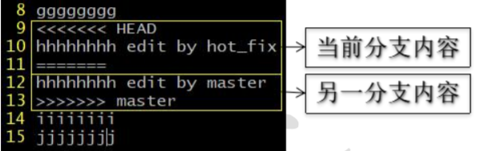

# Git&GitHub常用指令


## Git 命令行操作

1. 本地库初始化:

   + 命令：`git init`

     注意：.git 目录中存放的是本地库相关的子目录和文件，不要删除，也不要胡 乱修改。

   

2. 设置签名

   形式:

   ```shell
   用户名：tom Email 
   地址：goodMorning@atguigu.com
   作用：区分不同开发人员的身份
   ```

   命令:

   ```shell
   项目级别/仓库级别：仅在当前本地库范围内有效
   git config user.name tom_pro
   git config user.email goodMorning_pro@atguigu.com
   信息保存位置：./.git/config 文件
   
   系统用户级别：登录当前操作系统的用户范围
   git config --global user.name tom_glb
   git config --global user.email goodMorning_pro@atguigu.com
   信息保存位置：~/.gitconfig 文件3
   ```


3. 基本操作

   * 状态查看  `git status` 

     查看工作区、暂存区状态

   + 添加单个  `git add [file name]` 

     将工作区的“新建/修改”添加到暂存区

   + 添加全部  `git add .`

     将工作区的全部“新建/修改”添加到暂存区

   + 提交  `git commit -m "commit message" [file name]` 

     将暂存区的内容提交到本地库

   + 查看历史记录  `git log` 

     多屏显示控制方式： 空格向下翻页 b 向上翻页 q 退出

     + 以单行形式显示: `git log --pretty=oneline`
     + 或 `git log --oneline` (显示部分)
     + 显示HEAD@{移动到当前版本需要多少步}`git reflog`

     

4. 前进后退

   + 基于索引值操作[推荐] 

     + `git reset --hard [局部索引值]` 

     + `git reset --hard a6ace91` 

   + 使用^符号：只能后退 

     + `git reset --hard HEAD^` 

       注：一个^表示后退一步，n 个表示后退 n 步 

   + 使用~符号：只能后退 

     + `git reset --hard HEAD~n` 

       注：表示后退 n 步

     

5. reset 命令的三个参数对比

   + --soft 参数 

     仅仅在本地库移动 HEAD 指针

   + --mixed 参数 

     在本地库移动 HEAD 指针 

     重置暂存区

   + --hard 参数 

     在本地库移动 HEAD 指针 

     重置暂存区 

     重置工作区

   

6. 删除文件并找回

   + 前提：删除前，文件存在时的状态提交到了本地库。
   + 操作：`git reset --hard [指针位置]` 
     + 删除操作已经提交到本地库：指针位置指向历史记录 
     + 删除操作尚未提交到本地库：指针位置使用 HEAD


7. 比较文件差异

   + `git diff [文件名]` 

     将工作区中的文件和暂存区进行比较 

   + `git diff [本地库中历史版本] [文件名]` 

     将工作区中的文件和本地库历史记录比较 

   + 不带文件名比较多个文件

   

8. 分支操作

   + 创建分支 `git branch [分支名]` 

   + 查看分支 `git branch -v` 

   + 切换分支 `git checkout [分支名]` 

   + 合并分支 

     + 第一步：切换到接受修改的分支（被合并，增加新内容）上 

       `git checkout [被合并分支名]`

     + 第二步：执行 merge 命令 

       `git merge [有新内容分支名]`

   + 解决冲突

     + 冲突的表现:

     + 冲突的解决 

       + 第一步：编辑文件，删除特殊符号 

       + 第二步：把文件修改到满意的程度，保存退出 

       + 第三步：git add [文件名] 

       + 第四步：git commit -m "日志信息" 

         + 注意：此时 commit 一定不能带具体文件名

         

## 本地库和远程库


## GitHub

1. 创建远程库地址别名 

   + `git remote -v` 查看当前所有远程地址别名 

   + `git remote add [别名] [远程地址]`

2. 推送 

   + `git push [别名] [分支名]`

3. 克隆 

   + `git clone [远程地址]`

   + 效果 
     + 完整的把远程库下载到本地 
     + 创建 origin 远程地址别名 
     + 初始化本地库

4. 拉取 

   + `pull=fetch+merge` 

   + `git fetch [远程库地址别名] [远程分支名]` 

   + `git merge [远程库地址别名/远程分支名]` 

   + `git pull [远程库地址别名] [远程分支名]`

5. 解决冲突 
   + 要点 
     + 如果不是基于 GitHub 远程库的最新版所做的修改，不能推送，必须先拉取。
     + 拉取下来后如果进入冲突状态，则按照“分支冲突解决”操作解决即可。

6. SSH 登录

   + 进入当前用户的家目录 

     + $ `cd ~` 

   + 删除.ssh 目录 

     + $ `rm -rvf .ssh` 

   + 运行命令生成.ssh 密钥目录 

     + $ `ssh-keygen -t rsa -C atguigu2018ybuq@aliyun.com` 

     + [注意：这里-C 这个参数是大写的 C] 

   + 进入.ssh 目录查看文件列表 

     + $ `cd .ssh `
     + $ `ls -lF`

   + 查看 id_rsa.pub 文件内容

     + $ `cat id_rsa.pub` 

   + 复制 id_rsa.pub 文件内容，登录 GitHub，点击用户头像→Settings→SSH and GPG keys 

   + New SSH Key 

   + 输入复制的密钥信息 

   + 回到 Git bash 创建远程地址别名 

   + `git remote add origin_ssh git@github.com:atguigu2018ybuq/huashan.git` 

   + 推送文件进行测试